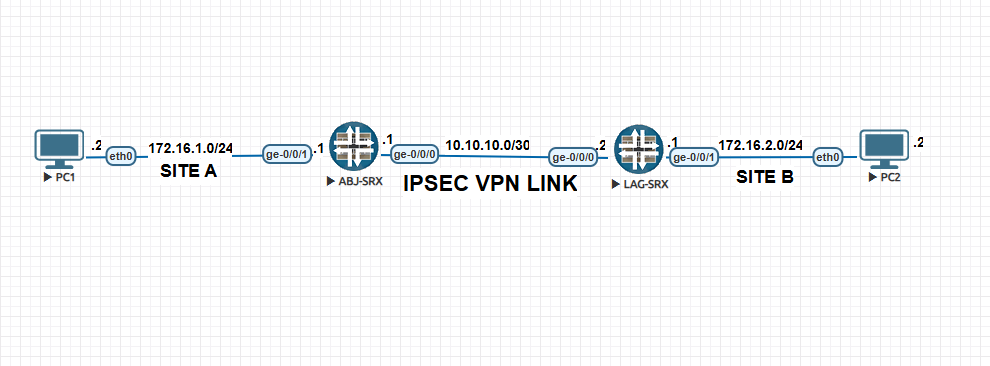

# 🔐 Site-to-Site IPSec VPN Lab (Juniper SRX - EVE-NG)

This project simulates a real-world scenario where a company (**Layer3**) with headquarters in **Abuja** and a branch office in **Lagos** wants to establish **secure communication** between both sites over the public internet using a **Site-to-Site IPSec VPN**.

The lab was built using **Juniper SRX firewalls** on **EVE-NG**, and includes full configuration files, the `.unl` topology file, and network diagrams to help you spin it up quickly.

---

## 🗺️ Topology Overview



- **Site A (Lagos)**  
  - LAN: `172.16.1.0/24`  
  - Firewall: `ABJ-SRX`  
  - Internet IP: `10.10.10.1/30`

- **Site B (Abuja)**  
  - LAN: `172.16.2.0/24`  
  - Firewall: `LAG-SRX`  
  - Internet IP: `10.10.10.2/30`

---

## 📁 Repo Structure

```bash
├── ABJ-SRX-CONFIG               # Full configuration for Site A firewall (ABJ-SRX)
├── LAG-SRX-CONFIG               # Full configuration for Site B firewall (LAG-SRX)
├── IPsec-vpn-eve_ng-unl-file.zip  # EVE-NG lab file to import the topology
├── ipsec-vpn-topology.jpg       # Network topology image
└── README.md                    # This file
